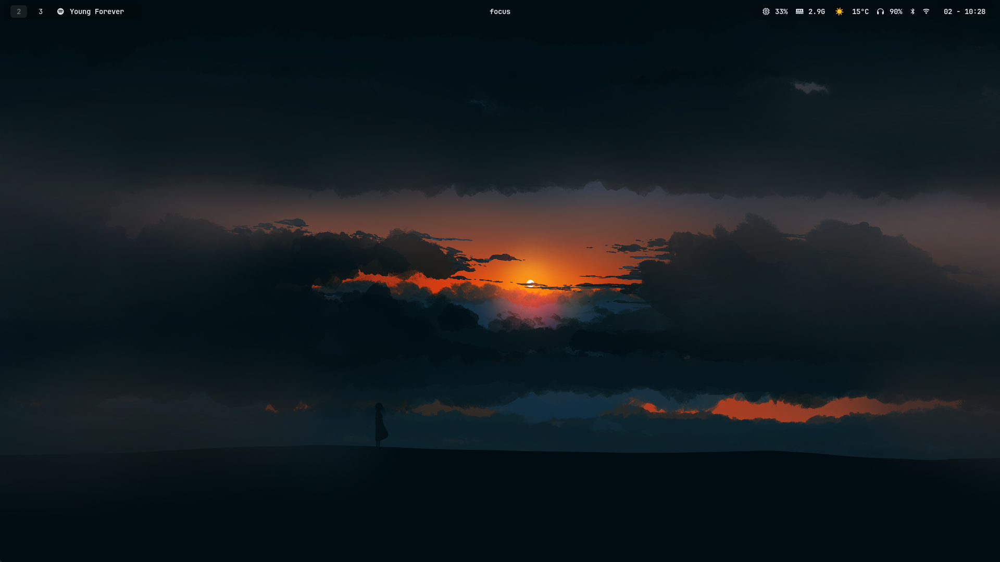
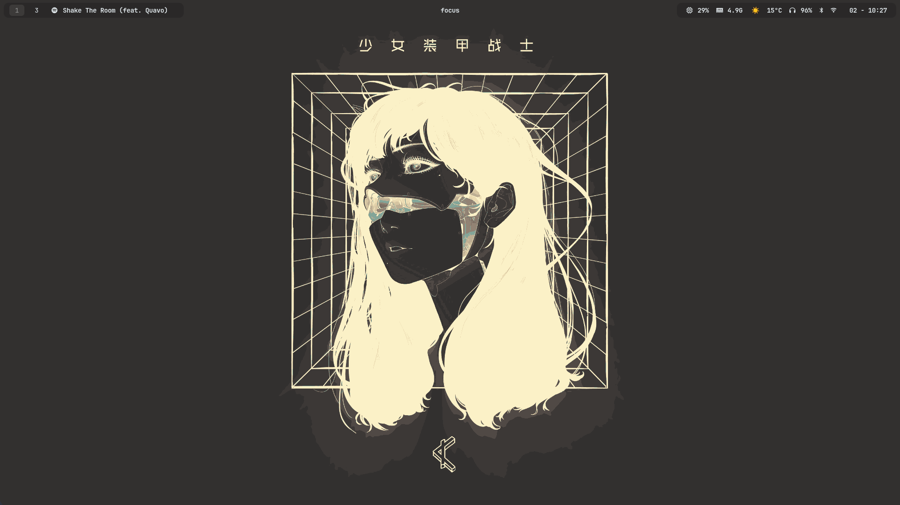
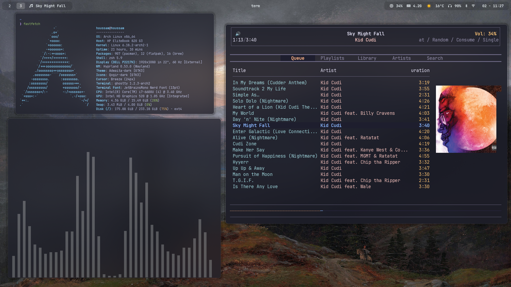
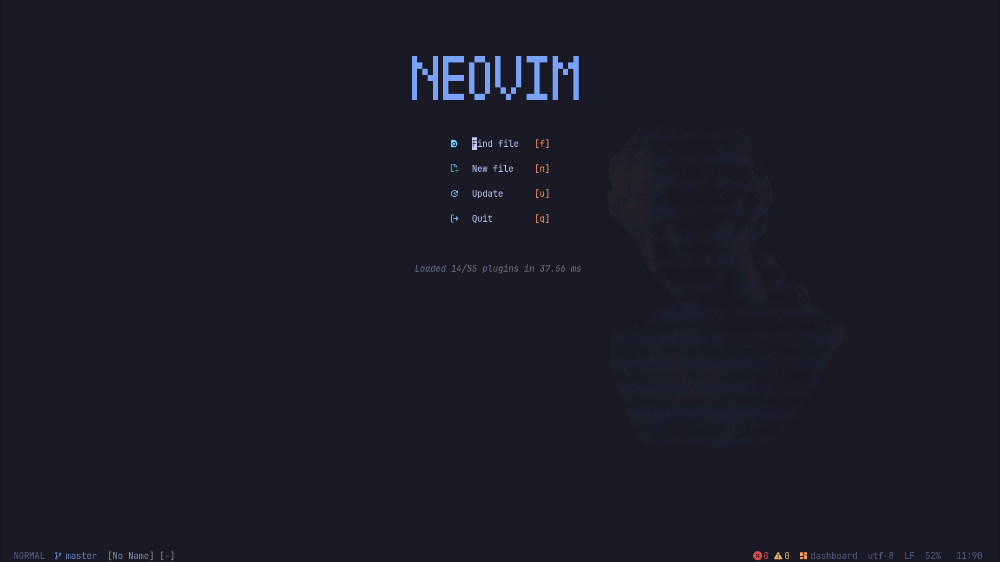

# dotfiles

## Overview

My **Arch Linux** dotfiles for a clean, lightweight Hyprland setup.
Managed with **[GNU Stow](https://www.gnu.org/software/stow/)** and optimized for a laptop + external monitor workflow.

## Install

>[!WARNING]
>Back up your existing configs before installing.
#### 1. Clone the repository
```bash
git clone https://github.com/houssamouhra/dotfiles.git ~/dotfiles
cd ~/dotfiles
```

#### 2. Install GNU Stow
Arch Linux:
```bash
sudo pacman -S stow
```
(Use your distro’s package manager if not on Arch.)

#### 3. Deploy the dotfiles
install configs selectively, Stow creates symlinks into `$HOME`.
```bash
cd ~/dotfiles
stow hypr nvim zsh waybar wofi ghostty wal mpd rmpc scripts kanshi
```

#### 4. Reload / apply configs
Some configs require a reload or restart
```
hyprctl reload
source ~/.zshrc
```

> [!NOTE]
> - Each directory represents a package managed by Stow
> - Files are symlinked into `$HOME` following the XDG layout (`~/.config/...`)
> - To remove a package: `stow -D <package-name>`

## Dependencies

<details>
<summary>Core</summary>

- **[hyprland](https://hypr.land/)** – Wayland compositor
- **[GNU Stow](https://www.gnu.org/software/stow/)** – dotfile symlink manager
- **[kanshi](https://github.com/emersion/kanshi)** – dynamic monitor management

</details>

<details>
<summary>UI / Desktop</summary>

- **[wofi](https://github.com/SimplyCEO/wofi)** – application launcher
- **[hyprlock](https://github.com/hyprwm/hyprlock)** – screen locker
- **[wlogout](https://github.com/ArtsyMacaw/wlogout)** – logout menu
- **[swaync](https://github.com/ErikReider/SwayNotificationCenter)** – notification daemon
- **[pywal](https://github.com/dylanaraps/pywal)** – wallpaper-based color theming

</details>

<details>
<summary>Terminal & Shell</summary>

- **[ghostty](https://ghostty.org/)** – terminal emulator
- **[zsh](https://www.zsh.org/)** – shell
- **[starship](https://starship.rs/)** – minimal and fast ZSH prompt

</details>

<details>
<summary>Editor & Tools</summary>

- **[Neovim](https://neovim.io/)** – editor
- **[tmux](https://github.com/tmux/tmux)** – terminal multiplexer
- **[yazi](https://yazi-rs.github.io/)** - terminal file manager
- **[mpd](https://www.musicpd.org/)** – Music Player Daemon
- **[rmpc](https://rmpc.mierak.dev/)** - terminal based mpd client

</details>

## Screenshots

<table>
  <tr>
    <td></td>
    <td></td>
  </tr>
  <tr>
    <td></td>
    <td></td>
  </tr>
</table>


## Packages to Install

```
hyprland
hypridle
waybar
wlogout
hyprshot
stow
git
ghostty
pywal
kanshi
swww
zip unzip
wofi
cava
rmpc
blueman
bluez
zathura
feh
bat
vlc
vlc-plugins-all
networkmanager
pipewire
pipewire-pulse
yay
brave-bin
imagemagick
yazi
ffmpeg
thunar
swaync
grim
grimblast
discord
wl-clipboard
wl-copy
fastfetch
spotx
yay
tldr
rg
fd
libnotify
```
